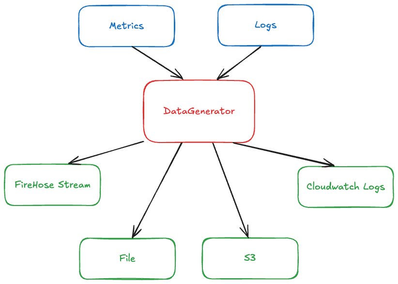

## Data Generator

A simple data generator for easy validations of Logs & Metrics ingestion.

### Quick Start

Require Go version 1.22+

- Clone the repository
- Copy `config.sample.yaml` and edit as needed.
- Start the data generator with config file as the only parameter
  `go run main.go --configFile ./config.yaml`

### Configurations

Check `config.sample.yaml` as a reference configuration.

### Data sources

##### Logs

ECS (Elastic Common Schema) formated logs based on zap.
Check [ecs-logging-go-zap](https://github.com/elastic/ecs-logging-go-zap) for adoption

#### Metrics

Generate metrics similar to a CloudWatch metrics entry. Limited support and tobe improved

