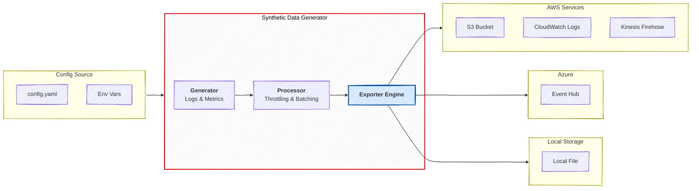

# Synthetic Data Generator

A flexible synthetic data generator in Go, designed to produce realistic logs and metrics for testing and development.




## Quick Start

Requires Go version 1.24+

- Clone the repository (alternatively download the latest release)
- Copy `config.sample.yaml` and edit as needed.
- Start the data generator with config file as the only parameter
  `go run cmd/main.go --config ./config.yaml`

> [!TIP]
> Use `--debug` flag for debug level logs.

## Configurations

Given below are the supported configuration options.
Check `config.sample.yaml` for reference.

### Input configurations

Given below are supported input types and their related environment variable overrides,

| YAML Property     | Environment Variable        | Description                                                                                                                                                                                                                                                                                                        |
|-------------------|-----------------------------|--------------------------------------------------------------------------------------------------------------------------------------------------------------------------------------------------------------------------------------------------------------------------------------------------------------------|
| `type`            | `ENV_INPUT_TYPE`            | Specifies the input data type (eg, `LOGS`, `METRICS`, `ALB`, `NLB`, `VPC`, `CLOUDTRAIL`, `WAF`).                                                                                                                                                                                                                   |
| `delay`           | `ENV_INPUT_DELAY`           | Delay between a data point. Accepts value in format like `5s` (5 seconds), `10ms` (10 milliseconds).                                                                                                                                                                                                               |
| `batching`        | `ENV_INPUT_BATCHING`        | Set time delay between data batches. Accepts a time value similar to delay. Default is set to `0` (no batching). Note: Batching is most effective with bulk ingest endpoints like S3 and Firehose. For CloudWatch Logs, batching may not be suitable as it concatenates multiple log entries into single messages. |
| `max_batch_size`  | `ENV_INPUT_MAX_BATCH_SIZE`  | Set maximum byte size of a batch. Default is to ignore (no max size).                                                                                                                                                                                                                                              |
| `max_data_points` | `ENV_INPUT_MAX_DATA_POINTS` | Set maximum amount of data points to generate. Default is to ignore (no max limit).                                                                                                                                                                                                                                |
| `max_runtime`     | `ENV_INPUT_MAX_RUNTIME`     | Set maximum duration load generator will run. Default is to ignore (no max limit).                                                                                                                                                                                                                                 |

Given below are supported `type` values for input,

| Log Type              | Description                                                                                             |
|-----------------------|---------------------------------------------------------------------------------------------------------|
| `ALB`                 | Generate AWS ALB formatted logs with some random content                                                |
| `NLB`                 | Generate AWS NLB formatted logs with some random content                                                |
| `VPC`                 | Generate AWS VPC formatted logs with randomized content                                                 |
| `CLOUDTRAIL`          | Generate AWS CloudTrail formatted logs with randomized content. Data is generated for AWS S3 Data Event |
| `WAF`                 | Generate AWS WAF formatted logs with randomized content                                                 |
| `AZURE_RESOURCE_LOGS` | Generate Azure Resource logs with randomized content                                                    |
| `LOGS`                | ECS (Elastic Common Schema) formatted logs based on zap                                                 |
| `METRICS`             | Generate metrics similar to a CloudWatch metrics entry                                                  |

Example:

```yaml
input:
  type: LOGS             # Input type LOGS
  delay: 500ms           # 500 milliseconds between each data point
  batching: 10s          # Emit generated data batched within 10 seconds
  max_batch_size: 10000  # Limit maximum batch size to 10,000 bytes. The output is capped at 1000 bytes/second max
  max_data_points: 10000 # Exit input after generating 10,000 data points
```

> [!TIP]
> When max_batch_size is reached, elapsed time for batching will be considered before generating new data

### Output configurations

Given below are supported output types (environment variable `ENV_OUT_TYPE`),

| Output Type      | Description                        |
|------------------|------------------------------------|
| `FIREHOSE`       | Export to AWS Firehose stream      |
| `CLOUDWATCH_LOG` | Export to AWS CloudWatch log group |
| `S3`             | Export to AWS S3 bucket            |
| `EVENTHUB`       | Export to Azure Event hub          |
| `FILE`           | Export to a file                   |

Sections below provide output specific configurations

#### S3

| YAML Property | Environment Variable  | Description                                                  |
|---------------|-----------------------|--------------------------------------------------------------|
| `s3_bucket`   | `ENV_OUT_S3_BUCKET`   | S3 bucket name (required).                                   |
| `compression` | `ENV_OUT_COMPRESSION` | To compress or not the output. Currently supports `gzip`.    |
| `path_prefix` | `ENV_OUT_PATH_PREFIX` | Optional prefix for the bucket entry. Default to `logFile-`. |

Example:

```yaml
output:
  type: S3
  config:
    s3_bucket: "testing-bucket"
    compression: gzip
    path_prefix: "datagen"
```

#### FIREHOSE

| YAML Property | Environment Variable  | Description                      |
|---------------|-----------------------|----------------------------------|
| `stream_name` | `ENV_OUT_STREAM_NAME` | Firehose stream name (required). |

Example:

```yaml
output:
  type: FIREHOSE
  config:
    stream_name: "my-firehose-stream"
```

#### CLOUDWATCH_LOG

| YAML Property | Environment Variable | Description                |
|---------------|----------------------|----------------------------|
| `log_group`   | `ENV_OUT_LOG_GROUP`  | CloudWatch log group name. |
| `log_stream`  | `ENV_OUT_LOG_STREAM` | Log group stream name.     |

Example:

```yaml
output:
  type: CLOUDWATCH_LOG
  config:
    logGroup: "MyGroup"
    logStream: "data"
```

> [!NOTE]
> CloudWatch Logs API (`PutLogEvents`) is optimized for single log messages per API call. When batching is enabled, multiple log entries are concatenated into a single message, which may not be ideal for log analysis and searching in CloudWatch. For CloudWatch destinations, consider setting `batching: 0s` (no batching) or using a small delay without batching. Batching is more suitable for bulk ingest endpoints like S3 and Firehose.


#### EVENTHUB

| YAML Property       | Environment Variable                 | Description                                     |
|---------------------|--------------------------------------|-------------------------------------------------|
| `connection_string` | `ENV_OUT_EVENTHUB_CONNECTION_STRING` | Connection string for the Event Hub namespace   |
| `event_hub_name`    | `ENV_OUT_EVENTHUB_NAME`              | Event hub entity name to export genereated data |
| `namespace`         | `ENV_OUT_EVENTHUB_NAMESPACE`         | Event hub namespace                             |

Example:

Using with connection string & event hub name:

```yaml
output:
  type: EVENTHUB
  config:
    connection_string: "Endpoint=sb:xxxxxx"
    event_hub_name: "<event_hub_name>"
```


Using with connection string & event hub name (requires IAM role assigned to the role running this application):

```yaml
output:
  type: EVENTHUB
  config:
    event_hub_name: "<event_hub_name>"
    namespace: "<namespace>"
```

#### FILE

| YAML Property | Environment Variable | Description                                                                                                                |
|---------------|----------------------|----------------------------------------------------------------------------------------------------------------------------|
| `location`    | `ENV_OUT_LOCATION`   | Output file location. Default to `./out`. When batching, file suffix will increment with numbers (e.g., `out_0`, `out_2`). |

Example:

```yaml
output:
  type: FILE
  config:
    location: "./data"
```

### Cloud provider configurations

#### AWS

| YAML Property | Environment Variable | Description                                                   |
|---------------|----------------------|---------------------------------------------------------------|
| `region`      | `AWS_REGION`         | Region to use by exporters. Default is `us-east-1`.           |
| `profile`     | `AWS_PROFILE`        | Credential profile to use by exporters. Default is `default`. |

Example:

```yaml
aws:
  region: "us-east-1"
  profile: "default"
```

## Examples

### 1. Continuous Log Generation to a S3 bucket

Generate ECS-formatted logs every 2s, batch them in 10 seconds and forward to S3 bucket

```yaml
input:
  type: LOGS
  delay: 2s
  batching: 10s
output:
  type: s3
  config:
    s3_bucket: "testing-bucket"
```

### 2. Continuous Log Generation with batching to a S3 bucket

Generate ALB logs. No delay between data points (continuous data generating).
Limit batching to 10 seconds and max batch size is set to 10MB. This translates to ~1 MB/second data load.
S3 files will be in `gzip` format.

```yaml
input:
  type: ALB
  delay: 0s
  batching: 10s
  max_batch_size: 10000000
output:
  type: s3
  config:
    s3_bucket: "testing-bucket"
    compression: "gzip"
```

### 3. Limit data points

Generate VPC logs and limit to 2 data points. Then upload it to S3 in `gzip` format.

```yaml
input:
  type: VPC
  delay: 1s
  max_data_points: 2
output:
  type: s3
  config:
    s3_bucket: "testing-bucket"
    compression: "gzip"
```

### 4. Limit runtime

Generate CLOUDTRAIL logs and limit to generator runtime of 5 minutes.

```yaml
input:
  type: CLOUDTRAIL
  delay: 10us       # 10 microseconds between data points
  batching: 10s
  max_runtime: 5m   # 5 minutes
output:
  type: s3
  config:
    s3_bucket: "testing-bucket"
    compression: "gzip"
```